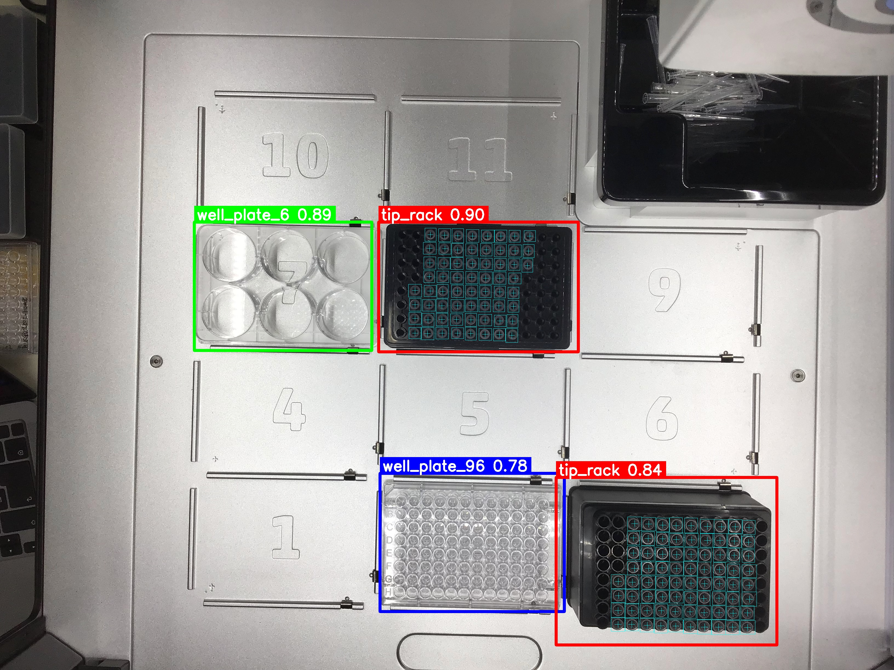
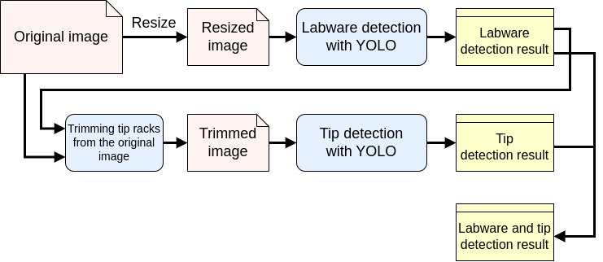
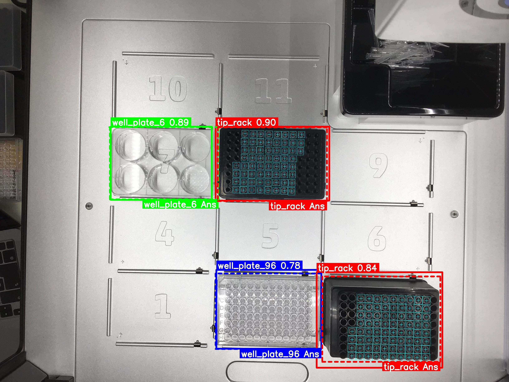

# ot2eye

## About ot2eye

ot2eye is a system that detects labwares such as well plates, tip racks and tips from images taken from the top of the OT-2 Liquid Handling System.




## Installation

```
$ git clone --recursive git@github.com:jst-robot/ot2eye-jst.git
$ cd ot2eye/yolov5/
$ python3 -m pip install -r requirements.txt 
```


## Demo

Download the dataset for demonstration. Downloading may take some time.

~~~~
$ cd ot2eye/
$ wget https://zenodo.org/record/7839440/files/example_dataset.zip?download=1
$ unzip example_dataset.zip?download=1
~~~~

Execution command.

~~~~
$ python3 ot2eye.py dataset/20220718_large/
~~~~

The generated "out" directory contains label files and images including bounding boxes for the detected labwares.


## Usage of Detection mode 

### Command

~~~~
$ python3 ot2eye.py <image_dir>
~~~~

* \<image_dir\>: Directory path of the images for which you want to detect labwares. Multiple images can be detected at once.

### Options

| Option               | Explanation                                                  | Default                                       |
| -------------------- | ------------------------------------------------------------ | --------------------------------------------- |
| --out-dir            | Directory path of the output files. If a directory with the same name already exists, a sequential number is assigned behind it. | out                                           |
| --model-labware      | Path of the YOLO model for detecting labwares other than tips. | model/exp_20230622+20230525/weights/best.pt |
| --model-tip          | Path of the YOLO model for detecting tips.                   | model/detect_tip_20220624/weights/best.pt     |
| --threshold          | Threshold for class determination. Same as option "conf" in YOLO v5's detect.py. | 0.7                                           |
| --labware-train-yaml | Path of the yaml file used for training of labware other than tip detection in YOLO. | model/dataset_20230622+20230525.yaml       |
| --evaluate           | Also executes evaluation mode. Specify the directory path of the ground truth labels. | None                                          |

### Required files

* A YOLO model for detecting labwares, excluding tips, from 640x480 images.
* The YAML file used for creating the above model. The label name for the tip rack must be "tip_rack".
* A YOLO model for detecting tips from 640x480 images.

### output files and directories

* \*\*\_labware/
  * Image files and label files of labwares detection results excluding tips.

* \*\*\_merged/
  * Image files and label files of labwares and tips detection results.

* \*\*\_tips/
  * Image files and label files of tip detection results.

* tmp/
  * Intermediate files generated for detection.


### Recommendation

The current model has been trained using images taken vertically from the top surface of the OT-2.


## How to detect labwares

1. Create a resized version of the original image.
2. Detect labwares in the resized image using YOLO (Model 1).
3. Based on the labware detection results, create trimmed images of individual tip racks from the original image.
4. Detect chips in the trimmed tip rack images using YOLO (Model 2).
5. Finally, merge the labware detection results and chip detection results, save them, and visualize the data.




## Creating a detection model

Example training can be downloaded as  follows.

~~~~
$ wget https://zenodo.org/record/7839440/files/training_dataset_ver1.zip?download=1
~~~~


## Usage of Evaluation mode

The accuracy of labware detection can be evaluated numerically.

### Commands

If used evaluation mode, it is specified by a command option.

```
$ python3 ot2eye.py <img_dir> --evaluate <ground truth_labels> 
```

* \<img_dir\>: Same as in detection mode.
* ground truth labels: directory path of the ground truth labels and classes.txt

### Required files

* To evaluate the accuracy of the detection, ground truth label files are required. This must be  in the same format as the YOLO training data. Refer to "1.2 Create Labels" on this page  (https://docs.ultralytics.com/yolov5/train_custom_data/#11-collect-images.) for details on the format of the YOLO training data.
* Put "classes.txt" in the same directory as the ground truth label files. This is usually generated automatically when the label files are created. The order of the labels must be the same as in the yaml file used for detection, and "tip" must be added at the end.

### Output files

* evaluation.csv
  
  * List of detection accuracies for each labware in each image. To perform the evaluation automatically and quickly
  
    1. Determine if the midpoint of the ground truth bounding box (the center of the tip) is contained within the predicted bounding box. If so, the detection is considered successful. 
  
       * N_pos: The number of ground truth bounding boxes.
  
       * Example: If there are 10 tips, N_pos=10.
  
    2. TP (True Positives): The number of ground truth bounding box midpoints contained within the predicted bounding boxes in the image.
  
       * Example: If 8 out of the 10 tips have overlapping predicted bounding boxes, TP=8.
  
    3. FP (False Positives): The number of predicted bounding boxes that do not contain the midpoint of a ground truth bounding box.
  
       * Example: If there are 12 predicted bounding boxes and 4 of them do not contain a tip (midpoint of the ground truth bounding box), FP=4.
  
    4. Precision = TP / (TP + FP)
  
    5. Recall = TP / N_pos
  
    6. F-value = 2 / (1/Precision + 1/Recall)
  
  * Example
  
    | #Image_file | #Labware      | #Recall | #Precision | #F-value |
    | ----------- | ------------- | ------- | ---------- | -------- |
    | demo.jpeg   | well_plate_6  | 1       | 1          | 1        |
    | demo.jpeg   | well_plate_96 | 1       | 1          | 1        |
    | demo.jpeg   | tip_rack      | 1       | 1          | 1        |
    | demo.jpeg   | tip           | 1       | 1          | 1        |
  
* images_evaluation/ (image_files)
  * a ground truth bbox surrounded by a dashed rectangle is added to the detection result image. The label names of the ground truth bboxes other than the tip are displayed in the lower right corner. 
  * The extension is the same as that of the input image.




## Confirmed environment

* Ubuntu 18.04.6 LTS
* Python 3.6.9


## Requirements

### Python modules

- OpenCV

- argparse

- subprocess

- csv

- yaml

- shutil

- glob


## License

MIT License
